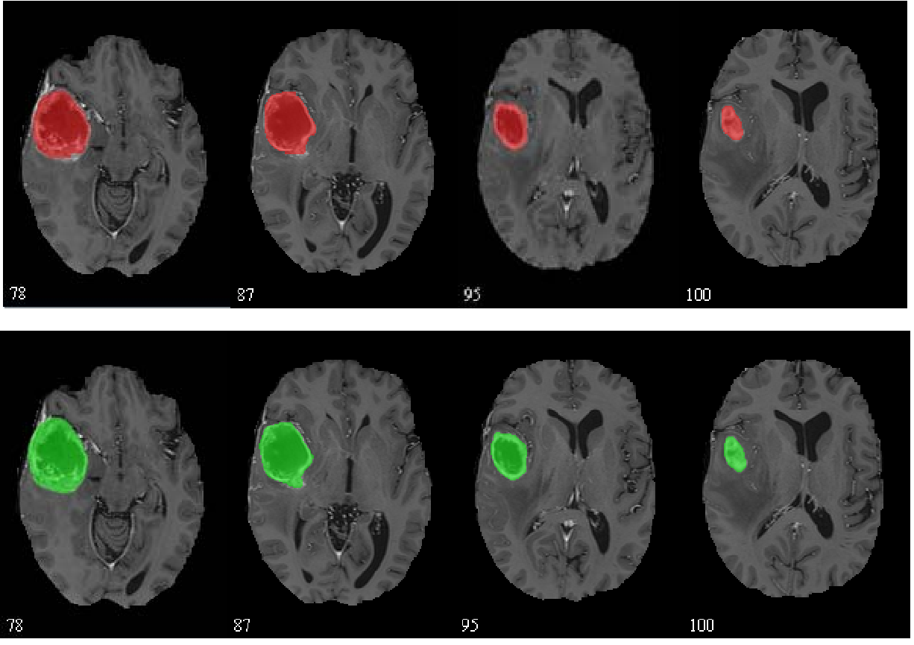
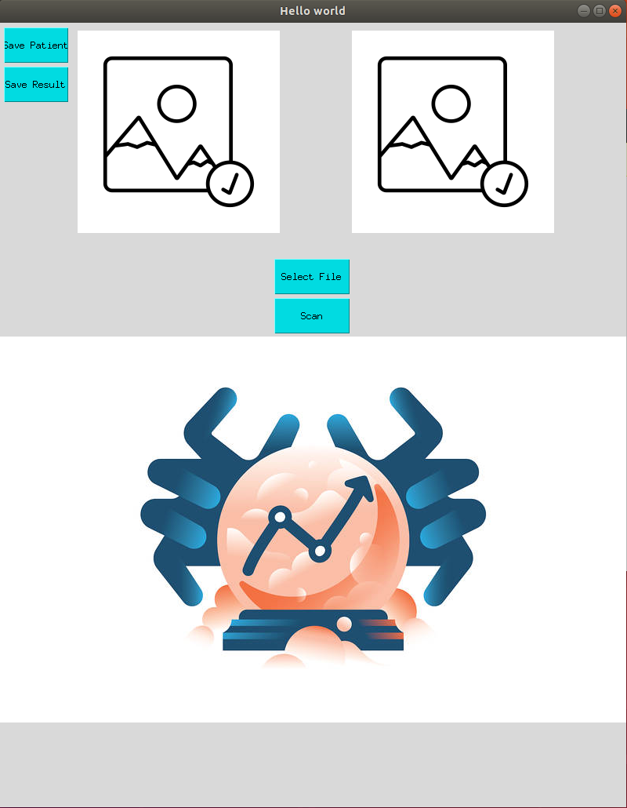
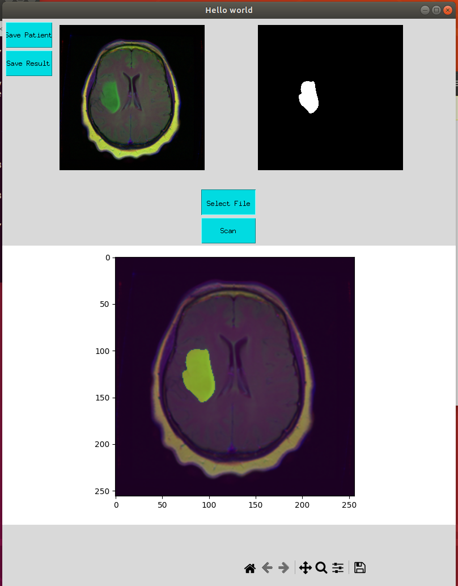

<h1>Máy phát hiện U não</h1>
<h2>Bài toán</h2>

Với bài toán y sinh khoanh vùng khu vực có chứa khối u não từ những tấm ảnh MRI, chúng tôi đã áp dụng unet  
    để có thể phân đoạn hình ảnh xác định vị trí của khối u não.

    

<h2>GUI Application</h2>

    
Đây là phần GUI của app AI. Chúng tôi đã tạo lên một GUI đơn giản với Tkinter và nó sẽ phụ trách việc tương tác  
        với model qua API và trực quan quá trình làm việc một cách dễ dàng.

    
    

<h2>Cài đặt AI</h2>
<h3>Những thứ cần chuẩn bị</h3>

    - Docker 
    - Python 3.9 
    - Model Unet (tải tại đây:)

<h3>Cài đặt model</h3>

Chúng ta sẽ cần clone github này về và sử dụng model unet đã được chúng tôi train ở phần chuẩn bị. Hãy bỏ model vào  
    thư mục: \model\deploy\model_repository\unet_model\1

Để serving model, chúng ta cần chạy lệnh docker ở phía bên dưới trong thư mục model/deploy: 
    "docker run --gpus=1 --rm --net=host -v ${PWD}/model_repository:/models nvcr.io/nvidia/tritonserver:23.11-py3 tritonserver --model-repository=/models"

<h2>Training model Unet</h2>

Bạn có thể tham khảo thêm cách training ở notebook chứa trong thư mục model/training 

